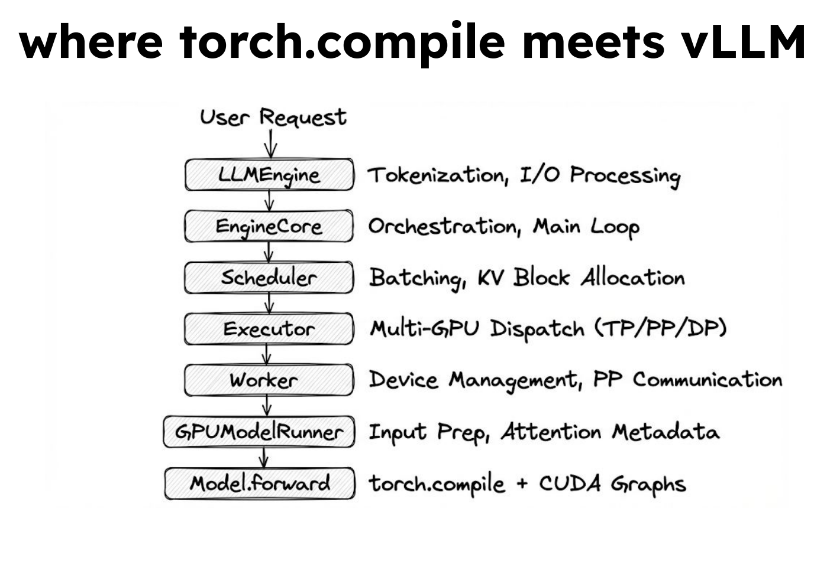
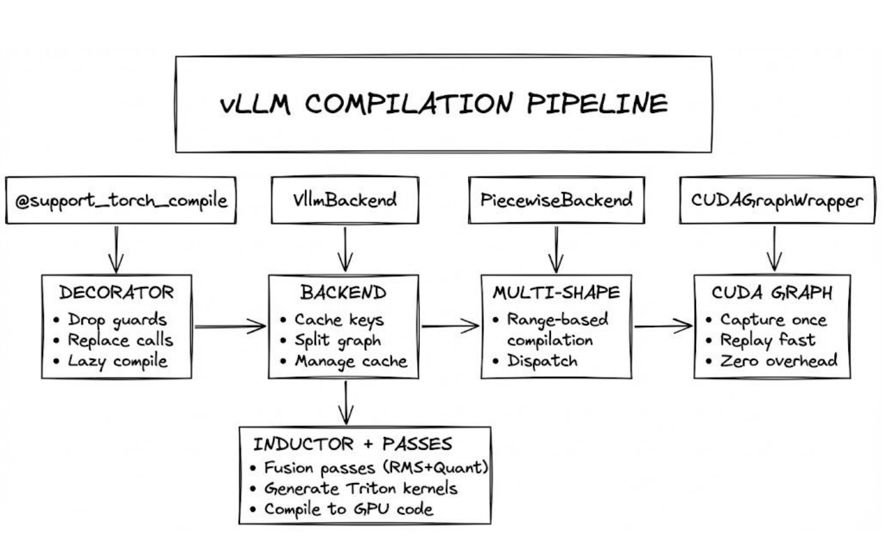

# A Walk Through vLLM's torch.compile Integration

When you enable compilation in vLLM, you get faster inference. But what's actually happening under the hood? vLLM's compilation mode is not a separate compiler. It's a pipeline built on top of `torch.compile`, PyTorch's JIT compiler. In this post, we'll walk through each layer of that pipeline, from the decorator that marks a model for compilation down to the CUDA Graphs that replay GPU commands with zero overhead.

To get the most out of this post, you should have a basic familiarity with vLLM and `torch.compile`. If you're new to either, the [Anatomy of vLLM](https://vllm.ai/blog/2025-09-05-anatomy-of-vllm) docs and the [torch.compiler documentation](https://pytorch.org/docs/stable/torch.compiler.html) are good starting points.

## Where torch.compile Meets vLLM

In vLLM, a user request flows through several layers: `LLMEngine` handles tokenization and I/O, `EngineCore` runs the main loop, `Scheduler` manages batching and KV block allocation, `Executor` dispatches work across GPUs, and `GPUModelRunner` prepares inputs and attention metadata. All of this stays in eager Python. Compilation enters the picture at the very last step, `Model.forward`, where `torch.compile` and CUDA Graphs take over.



The serving infrastructure deals with variable batch sizes, continuous batching, and preemption. That kind of dynamic control flow doesn't benefit from compilation. The forward pass is a fixed computation graph, and that's what a compiler can optimize.

## The Compilation Pipeline

vLLM builds a four-layer pipeline on top of `torch.compile`.



### Layer 1: Decorator and Wrapper

The entry point is `@support_torch_compile`, a decorator applied to model classes in `vllm/compilation/decorators.py`. It modifies `__init__` and `__call__` but leaves `forward()` untouched:

```python
@support_torch_compile(dynamic_arg_dims={"hidden_states": 0})
class MyModel(nn.Module):
    def forward(self, hidden_states, ...): ...
```

The wrapped `__init__` stores the vLLM config and calls `torch.compile` to create the compiled callable. On the first `__call__`, dynamic dimensions are marked so the compiler knows batch size can vary, and the compiled callable runs for the first time. This is when tracing and compilation actually happen. On every subsequent call, execution goes directly to the compiled callable with minimal dispatch overhead.

### Layer 2: vLLM Backend

When `torch.compile` traces the model, it produces an FX graph and passes it to vLLM's custom backend (`VllmBackend` in `backends.py`). The backend does three things:

**Cache key generation.** It hashes the environment, vLLM config, traced code, and compiler state into a deterministic cache key, so recompilation is avoided across restarts. You pay the compilation cost once. Subsequent runs load from cache.

**Graph splitting.** The FX graph is split at configurable boundary ops, typically attention operations like `vllm::unified_attention_with_output`. Attention runs as a custom op in its own graph partition, separate from the surrounding computation. Everything between attention ops (norms, linear layers, activations) gets compiled and optimized by Inductor. vLLM keeps its hand-tuned attention kernels while `torch.compile` handles everything else.

**Piecewise compilation.** Each resulting subgraph gets its own `PiecewiseBackend` and CUDA Graph wrapper.

### Layer 3: Piecewise Backend

Different batch sizes benefit from different optimizations. A single decode step (batch size 1) and a large prefill (batch size 4096) have very different performance profiles. Compiling a single kernel that handles all sizes means the compiler can't specialize for any of them.

The piecewise backend (`piecewise_backend.py`) handles this with a two-tier compile strategy. It maintains a general compile range (e.g., 1 to 8192) alongside specific compiled kernels for common batch sizes (1, 128, 256, etc.). All ranges are compiled eagerly during initialization, so by the time inference starts, every kernel is ready. No compilation happens on the hot path.

At runtime, the dispatch logic checks if the incoming batch size has a specific kernel and uses it if so. Otherwise, it falls back to the general range. Common batch sizes get shape-specialized code; uncommon ones still run compiled, just not shape-specialized.

### Layer 4: CUDA Graph Wrapper

Even after compilation, there is Python dispatch overhead. Each kernel launch costs roughly 5 to 20 microseconds. CUDA Graphs eliminate this. On the first call for a given batch descriptor, all GPU commands are recorded into a command buffer. On every subsequent call, the buffer is replayed directly on the GPU:

```python
# First call: record
with torch.cuda.graph():
    output = runnable(*args)
entries[batch_descriptor] = CUDAGraphEntry(graph, output)

# Subsequent calls: replay
entries[batch_descriptor].cudagraph.replay()
```

The wrapper maintains a dictionary mapping `BatchDescriptor` to `CUDAGraphEntry`. First call records. Every call after replays.

## Fusion Passes

Between tracing and code generation, vLLM runs custom Inductor passes that fuse operations to reduce memory traffic. The pass manager (`vllm/compilation/passes/`) has around 20 configurable passes. The key ones:

**NoOpElimination** removes redundant reshapes and slices (e.g., reshapes added by `apply_fp8_linear` that are unnecessary in the 2D case).

**RMSNorm+Quant** fuses normalization with quantization. Without fusion, this looks like:

```python
x = rms_norm(input)    # kernel 1: read input, write x
y = fp8_quant(x)       # kernel 2: read x, write y
z = gemm(y, w)         # kernel 3: read y and w, write z
```

The first two kernels alone cost 2 reads and 2 writes to global memory. After fusion, `rms_norm` and `fp8_quant` collapse into a single kernel: 1 read and 1 write. The intermediate tensor `x` never hits global memory. In memory-bandwidth-bound LLM inference, that reduction matters.

**Attention+Quant** fuses attention output processing with FP8 or NV-FP4 quantization.

**AllReduceFusion** fuses AllReduce with RMSNorm for communication/compute overlap in tensor-parallel setups.

**FixFunctional** de-functionalizes the graph. It always runs last.

Other passes handle sequence parallelism, async tensor parallelism, RoPE+KV cache fusion, and MLA-specific optimizations, each gated behind its own config flag.

## Putting It Together

Here is the end-to-end flow when vLLM runs with compilation enabled:

1. `@support_torch_compile` wraps the model class
2. First inference marks dynamic dimensions and runs the compiled callable for the first time (this is when Dynamo actually traces)
3. TorchDynamo traces the forward pass into an FX graph
4. `VllmBackend` splits the graph at attention boundaries and compiles each subgraph via the compiler interface (typically Inductor) with vLLM's fusion passes
5. Optimized GPU kernels are generated and cached
6. `PiecewiseBackend` dispatches to the right compiled kernel based on batch size
7. CUDA Graphs record the first execution and replay all subsequent ones

The model's forward pass ends up running as fused, optimized kernels replayed via CUDA Graphs, with vLLM's attention ops in their own partitions between compiled regions. No Python dispatch overhead, no redundant memory traffic.

The serving infrastructure (scheduling, batching, KV management) stays in flexible, debuggable Python. The model computation gets the full benefit of `torch.compile`, Inductor, and CUDA Graphs. Graph splitting at attention ops lets vLLM keep its own hand-tuned attention kernels without giving up compilation benefits everywhere else.

To explore the implementation, start with `vllm/compilation/decorators.py` and follow the pipeline through `backends.py`, `piecewise_backend.py`, the `passes/` directory, and `cuda_graph.py`.

---

*By [Ayush Satyam](https://github.com/ayushsatyam146), Associate MLE at Red Hat*
